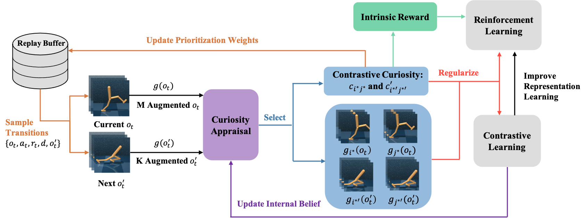

# CCLF: Contrastive-Curiosity-Driven Learning Framework

This is the original PyTorch implementation of CCLF on SAC for the DeepMind control experiments, from the paper "CCLF: A Contrastive-Curiosity-Driven Learning Framework for Sample-Efficient Reinforcement Learning" (accepted by IJCAI 2022). Our implementation is based on [CURL](https://github.com/MishaLaskin/curl) and [DrQ](https://github.com/denisyarats/drq).



## Citation

If you find this code helpful in your research, please consider citing the paper as follows
```
@misc{sun2022cclf,
      title={CCLF: A Contrastive-Curiosity-Driven Learning Framework for Sample-Efficient Reinforcement Learning}, 
      author={Chenyu Sun and Hangwei Qian and Chunyan Miao},
      year={2022},
      eprint={2205.00943},
      archivePrefix={arXiv},
      primaryClass={cs.LG}
}
```


## Installation 

All of the dependencies are in the `conda_env.yml` file. They can be installed manually or with the following command:

```
conda env create -f conda_env.yml
```

## Instructions
To train a curious agent on the `cartpole swingup` task from image-based observations run `bash script/run.sh` from the root of this directory. The `run.sh` file contains the following command, which you can modify to try different environments / hyperparamters.
```
python -u train.py \
    --domain_name cartpole \
    --task_name swingup \
    --encoder_type pixel \
    --action_repeat 8 \
    --save_tb --pre_transform_image_size 100 --image_size 84 \
    --work_dir ./tmp \
    --agent CCLF_sac --frame_stack 3 \
    --seed 360 --critic_lr 1e-3 --actor_lr 1e-3 --eval_freq 1250 --batch_size 512 --num_train_steps 63000 --K_num 5 --M_num 5
```

In your console, you should see printouts that look like:

```
| eval | S: 0 | ER: 18.7675
| train | E: 1 | S: 500 | D: 0.4 s | R: 0.0000 | BR: 0.0000 | A_LOSS: 0.0000 | CR_LOSS: 0.0000 | CU_LOSS: 0.0000
| train | E: 5 | S: 1000 | D: 0.4 s | R: 136.0366 | BR: 0.0000 | A_LOSS: 0.0000 | CR_LOSS: 0.0000 | CU_LOSS: 0.0000
| train | E: 9 | S: 1250 | D: 0.0 s | R: 178.2814 | BR: 1.0437 | A_LOSS: -1.6998 | CR_LOSS: 2.8796 | CU_LOSS: 5.6792
| eval | S: 1250 | ER: 35.0508
| train | E: 0 | S: 1500 | D: 94.5 s | R: 0.0000 | BR: 1.0712 | A_LOSS: -3.6507 | CR_LOSS: 2.1011 | CU_LOSS: 4.1821
| train | E: 13 | S: 2000 | D: 96.0 s | R: 183.0705 | BR: 1.0965 | A_LOSS: -5.4314 | CR_LOSS: 2.1541 | CU_LOSS: 2.9452
| train | E: 17 | S: 2500 | D: 0.0 s | R: 55.8144 | BR: 1.0339 | A_LOSS: -7.6148 | CR_LOSS: 2.4689 | CU_LOSS: 2.5492
| eval | S: 2500 | ER: 254.8489
| train | E: 0 | S: 2500 | D: 107.1 s | R: 0.0000 | BR: 0.0000 | A_LOSS: 0.0000 | CR_LOSS: 0.0000 | CU_LOSS: 0.0000
| train | E: 21 | S: 3000 | D: 97.5 s | R: 217.0974 | BR: 1.1880 | A_LOSS: -9.9664 | CR_LOSS: 4.7985 | CU_LOSS: 2.7503
| train | E: 25 | S: 3500 | D: 94.6 s | R: 180.9111 | BR: 1.2755 | A_LOSS: -13.0526 | CR_LOSS: 5.4130 | CU_LOSS: 2.7915
| train | E: 29 | S: 3750 | D: 0.0 s | R: 211.9625 | BR: 1.2483 | A_LOSS: -15.4376 | CR_LOSS: 4.8176 | CU_LOSS: 2.8847
```

For reference, the maximum score for cartpole swing up is around 860 pts, so our framework has converged to the optimal score. This takes about an a couple hours of training depending on your GPU. 

Log abbreviation mapping:

```
train - training episode
E - total number of episodes 
S - total number of environment steps
D - duration in seconds to train 1 episode
R - mean episode reward
BR - average reward of sampled batch
A_LOSS - average loss of actor
CR_LOSS - average loss of critic
CU_LOSS - average loss of the CURL encoder
```

All data related to the run is stored in the specified `working_dir`. To enable model or video saving, use the `--save_model` or `--save_video` flags. For all available flags, inspect `train.py`. To visualize progress with tensorboard run:

```
tensorboard --logdir log --port 6006
```

and go to `localhost:6006` in your browser. If you're running headlessly, try port forwarding with ssh. 

For GPU accelerated rendering, make sure EGL is installed on your machine and set `export MUJOCO_GL=egl`. For environment troubleshooting issues, see the DeepMind control documentation.


